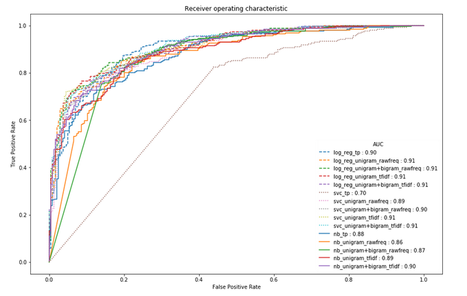

# NLP Project : Sentiment Analysis on IMBD Movie Reviews

#### Introduction

This project is an attempt to reproduce Bo Pang, Lillian Lee, Shivakumar Vaithyanathan's paper on sentiment classification using machine learning techniques. The study considers the problem of classifying documents by overall sentiment, namely determining whether a review is positive or negative. Using movie reviews as data, we find that standard machine learning techniques ( Logistic Regression, Naive Bayes and Support Vector Machines) definitively out perform human-produced baselines. 

#### Experimental Set-up

##### Data

For our experiments, we used documents from the movie-review corpus. This domain is experimentally convenient because there are large online collections of such reviews, and because reviewers often summarize their overall sentiment with a machine-extractable rating indicator, such as a number of stars; hence, we did not need to hand-label the data for supervised learning or evaluation purposes. The data is downloaded from the paper's website. To create a data set with uniform class distribution we randomly selected 1000 positive-sentiment and 1000 negative-sentiment documents.

##### Method

The data was already preprocessed by the authors(HTML tags were extracted). Then, it was divided into two folds (train and test), maintaining balanced class distributions in each fold. No stemming or stoplists were used.

Words from documents were extracted with bag of words model with unigrams and both unigrams and bigrams. Three types of word vector representation were implemented on the data: the presence of terms(only binary values), raw term frequencies and TF-IDF values.

Three models were used for the classification problem: Logistic Regression with L1 and L2 regularization, SVM with linear kernel and Multinominal Naive Bayes. Hyperparameters were tuned with scikit-learn's GridSearchCV module with 5-fold cross validation to assess the model performance. 

The performance of the models were evaluated both with accuracy ($ACC= \frac{TP+TN}{FN+FP+TP+TN}$) and F1-score metrics ($  PRE=\frac{TP}{TP+FP} ~~ REC=\frac{TP}{TP+FN} ~~ F1=2\times \frac{PRE\times REC}{PRE+REC} $.) Receiver operator characteristic (ROC) graphs were also used for evaluating models. Based on the ROC curve, so-called area under the curve (AUC) is calculated to characterize the performance of a classification model.

Language of implementation: Python 2.7
#### Findings

In  most of the cases, logistic regression outperformed SVM and NB classifiers. Using only the presence of terms is a simple way of representing the words. Yet, using only presence of terms had approximately same performance with the other vector representation techniques. Using both unigrams and bigrams did  not increase the accuracy of the model in this work. AUC also supports the idea that logistic regression had at least the same performance or higher than the other models.

| Features |  Frequency   or Presence? || Accuracy | || F1-Score ||
| :---: |  :---:  | ---:  |  :---:  |   :--- |   ---: |   :---: |   :--- |
|  |                          | **NB** | **LogReg** | **SVM** | **NB** | **LogReg** | **SVM** |
| unirams  | pres.            | 0.78  |     **0.83**    |0.52     | 0.76  | **0.85**  | 0.68  |
| unirams    | freq.          | 0.80  |     **0.82**     |   0.81   | 0.80  | **0.83** |0.80
| unirams    | tf-idf         | 0.81  |     **0.83**     |   0.82   | 0.82  |**0.83**| 0.82  | 
| unigram + bigrams   |  freq.| 0.79  |     **0.82**     |  **0.82**  | 0.80  |**0.83** | **0.83** |
| unigram + bigrams   | tf-idf| **0.81**  |     **0.81**     |  **0.81**  |**0.82**  | **0.82** |**0.82**   |

*Bo Pang, Lillian Lee, Shivakumar Vaithyanathan -  Thumbs up? Sentiment Classification using Machine Learning Techniques
http://www.cs.cornell.edu/people/pabo/movie-review-data/ 
